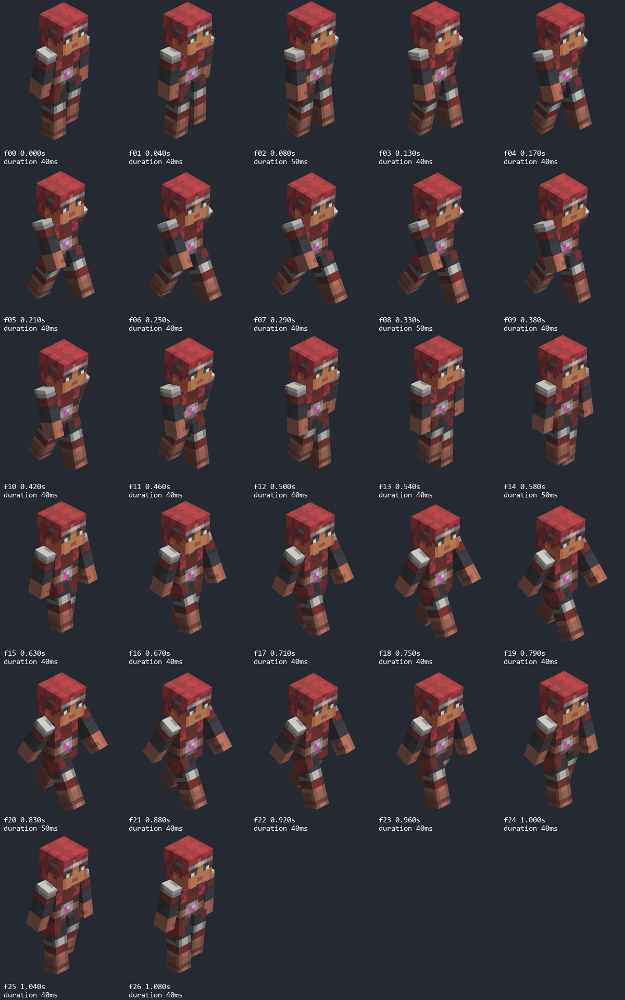
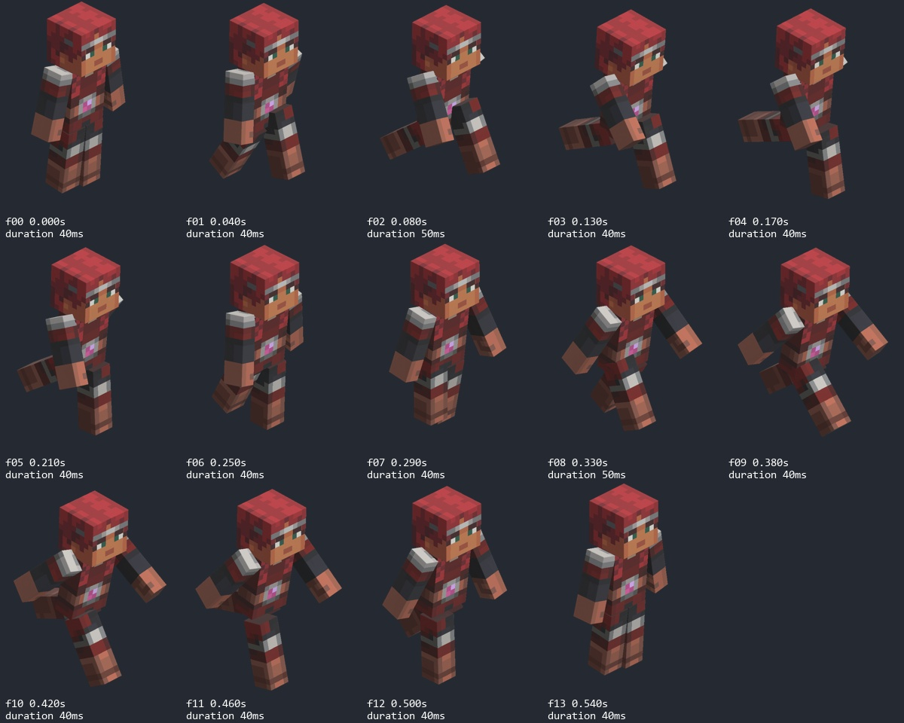
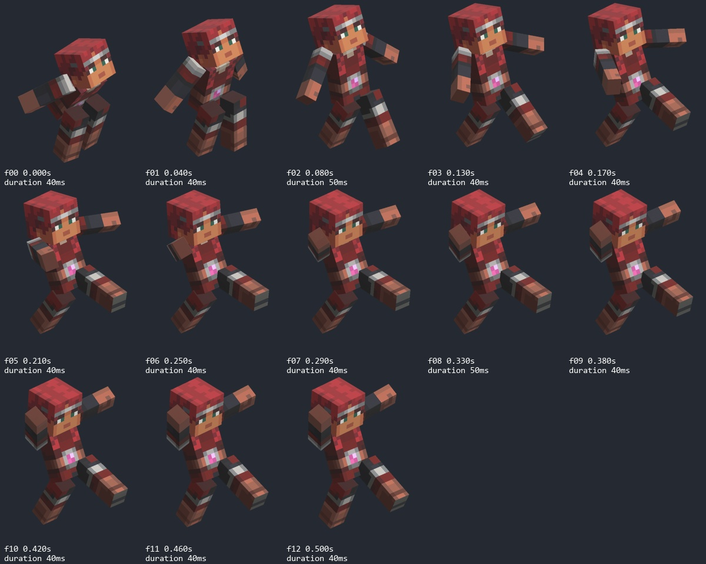
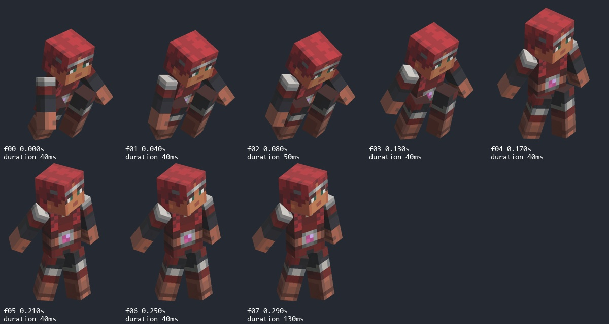

# Animation style guide — expressive rigid characters

Research date: **2026-10-10, Asia/Saigon**. Target: our original mobile-first game, informed primarily by **Minecraft Dungeons II**. Status: **reusable research baseline and proposed quality standard; artistic approval pending**. No existing model, rig, Action, animation, controller or scene was changed by this research.

## 1. What this research establishes

The strongest inspected reference is the sequel hero's complete **walk, run, jump and jump-land GIF sequences**, supported by selected official gameplay-trailer pixels. They show that straight-edged limbs can remain visually rigid while their orientation, spacing, rhythm and relationship to the torso change substantially. Expression comes from articulated **relationships between blocks**, not necessarily from bending or stretching the blocks themselves.

For our game, prioritize readable arm/leg separation, a distinct running stride, an asymmetric airborne silhouette, and uninterrupted support-to-flight-to-support transitions. A wide swing must still look attached to the shoulder, respect weapon grips and read at the gameplay camera. More amplitude alone is not a quality improvement.

**Evidence limit:** the supplied continuous Dailymotion walkthrough could not play. Trailer and reel inspection was selective, not a frame-by-frame review of their complete durations. Full-cycle visual inspection was performed on the four GIFs. Consequently, the sequel's exact transition rules, input latency, gait synchronization, shoulder translations and head-follow timing are **not established**. The guide supplies concrete original implementation recommendations and a targeted plan to close those gaps; it does not present them as reconstructed Dungeons II internals.

### Evidence labels

| Label | Meaning |
|---|---|
| **O — observed** | Visible in the explicitly identified image/frame sequence. Limited to its camera, character, action and source quality. |
| **M — measured** | Obtained from this session's file decoding or metadata. Scope and units must accompany the number. |
| **D — documented** | A named source explicitly states it. Developer testimony, community workflow and engine documentation have different scopes. |
| **H — hypothesis** | A possible explanation of visible motion, not a verified implementation detail. |
| **P — proposal** | Our original design or evaluation recommendation; requires implementation and review before approval. |
| **U — unknown** | Evidence is missing, occluded, unplayable or insufficient. |

Never promote O to a claim about bone hierarchy, constraints, IK, motion capture, procedural animation or physics. Never promote P to user approval. Research priority is II gameplay → II continuous recordings → relevant professional work from I → isolated reference renders → generic technical documentation.

## 2. Source register and actual access

All access results below refer to this research session, not a promise of future availability. Browser playback was checked in addition to text retrieval. A loaded page or transcript alone is not video analysis.

| ID | Source and game | Access and inspected scope | Appropriate use |
|---|---|---|---|
| S1 | [Official Gameplay Trailer](https://www.youtube.com/watch?v=vBNE3bKMpu8), **II** | Playback/pixels accessible. Selected shots inspected; precise saved samples at **00:28.719099, 00:38.719100, 00:48.719100**. Additional coarse observations near 00:23, 00:33 and 00:43. | Gameplay-scale readability and staging. Edited trailer, not continuous movement or a timing benchmark. |
| S2 | [37-minute walkthrough supplied by user](https://www.dailymotion.com/video/xbfhi7u), labelled **II**, More RGB More FPS | Page/title accessible. Player returned **“Unable to play media”**, including after reload; a sign-in overlay also appeared. **No gameplay frames analyzed.** Approximate duration comes from user, not a successful decode. | Pending continuous gameplay evidence. No invented timestamps. |
| S3 | [Official gameplay article](https://www.minecraft.net/en-us/article/minecraft-dungeons-ii-gameplay-trailer), **II** | Text page accessible; official context for the trailer. | Source identity/context; no technical rig disclosure established here. |
| S4 | [Rich Stubbs — Tech Anim Showreel 2025](https://richstubbs96.artstation.com/projects/2BGWqB) | Description read; embedded Vimeo playable. Rig pixels observed near 00:05 and saved at **00:11.557841**; separate personal-project frame observed near 00:48. Not a complete reel analysis. | Direct author statement about **I DLC boss rigs**; distinguish them from personal Blender rigs and from II. |
| S5 | [Jungle Awakens reel](https://richstubbs96.artstation.com/projects/eaY94Y), **I DLC** | Description and video accessible. Saved gameplay at **00:11.897735**, isolated boss pose at **00:21.958333**. | Secondary staging and block-mass articulation example, not II player gait. |
| S6 | [Howling Peaks reel](https://richstubbs96.artstation.com/projects/OoLXJg), **I DLC** | Description and video accessible. Saved multi-view attack pose at **00:25.360962**. | Secondary silhouette/weapon presentation; no measured complete cycle. |
| S7 | [Echoing Void reel](https://richstubbs96.artstation.com/projects/oA3yBw), **I DLC** | Description and video accessible. Saved gameplay frame at **00:45.103786**. | Secondary game-context sample; too sparse/occluded to derive gait or transition timing. |
| S8 | [Animated mob render category](https://minecraft.wiki/w/Category:Minecraft_Dungeons_animated_mob_renders), **I** | Browser category/file listings accessible, including Arch-Illager Run file metadata. That run was **not decoded or cycle-analyzed**. | Reference index. Listed animations are not automatically analyzed sources. |
| S9 | [Wiki isometric-render guide, Dungeons I](<https://minecraft.wiki/w/Help:Isometric_renders_(Minecraft_Dungeons)>) | Text accessible in browser; web-text fetch failed. Import, weight-mapping and animation-rendering sections read. | Community reconstruction/rendering workflow, not the developer authoring pipeline. |
| S10 | [Wiki isometric-render guide, Dungeons II](<https://minecraft.wiki/w/Help:Isometric_renders_(Minecraft_Dungeons_II)>) | Followed from S9; read in browser. Page explicitly says it was cloned from the I guide and needs overhaul; free-camera section carries an outdated-information warning. | Important evidence limitation. Similar prose is **not** evidence of identical rigs or tools. |
| S11 | [Dungeons II hero gallery](https://minecraft.wiki/w/Dungeons_II:Hero) | Browser gallery and four file pages accessible. Run/walk GIFs downloaded for research; jump/land compared with existing local references. | Isolated sequel-labelled animation renders. Stronger for poses than for runtime transitions. |

S4 **D:** Stubbs explicitly identifies his first set of showcased Dungeons DLC rigs as made in **Maya**, combining manual and automated work. His description separately identifies a personal TMNT Blender rig with IK/FK and pose-tweaking controls. This supports neither “Dungeons was rigged in Blender” nor “Dungeons II uses the same rig.” The author describes multilimbed bosses; do not generalize their controls to the player. [S4](https://richstubbs96.artstation.com/projects/2BGWqB)

S9 **D:** the community guide discusses PSK models, PSA animations, an imported armature, Actions and attaching equipment to a named hand bone. This supports the existence of a skeletal data/rendering workflow in that guide. It does not expose the complete original control rig. No proprietary model or animation-keyframe extraction was performed for this research. [S9](<https://minecraft.wiki/w/Help:Isometric_renders_(Minecraft_Dungeons)>)

### Primary cycle evidence and provenance

| ID | File page | Exact inspected range, zero-based frame index | Decoded display duration |
|---|---|---|---:|
| G1 | [II Hero Run](<https://minecraft.wiki/w/File:Player_Master_Run_(Dungeons_II).gif>) | f00–f13, starts **0.000–0.540 s**; complete GIF | **14 frames / 0.580 s** |
| G2 | [II Hero Walk](<https://minecraft.wiki/w/File:Player_Master_Walk_(Dungeons_II).gif>) | f00–f26, starts **0.000–1.080 s**; complete GIF | **27 frames / 1.120 s** |
| G3 | [II Hero Jump](<https://minecraft.wiki/w/File:Player_Jump_(Dungeons_II).gif>) | f00–f12, starts **0.000–0.500 s**; complete GIF | **13 frames / 0.540 s** |
| G4 | [II Hero Jump Land](<https://minecraft.wiki/w/File:Player_Jump_Land_(Dungeons_II).gif>) | f00–f07, starts **0.000–0.290 s**; complete GIF | **8 frames / 0.420 s** |

**M:** these are GIF presentation delays, usually 40/50 ms, not 30 FPS engine frames. G4's last frame lasts **130 ms**; counting eight equally spaced samples would misrepresent its ending. A GIF's last displayed-frame timestamp and total duration are different. Do not add G3 and G4 durations and call the sum the game's jump duration: runtime could hold, skip or blend sections.

G3's current downloaded file is byte-identical to the stored user reference (SHA256 `43948585444626346368812c9a3b3366e0476ad2455ceb3d47b80def133b0d84`). G4's current downloaded bytes differ from the stored file; frame comparison is recorded in [land_source_match.json](references/style_research_2026_10_10/land_source_match.json). Visible pixels and presentation delays match; do not call the two files byte-identical. Run/walk hashes, every frame delay and crop rectangle are in [wiki_cycles.json](references/style_research_2026_10_10/wiki_cycles.json).

These are community-presented renders attributed to Mojang imagery, not recordings of state transitions in the running sequel. Their file pages link to the II hero. They reveal visible animation output, not the authoring controls or gameplay state graph.

### Source correction: earlier local recordings

The three videos in [jump_set_v002/references.json](../../blender/animation/reviews/player_animation_library_v1/jump_set_v002/references.json) were decoded again, independently of the old study's conclusions:

- Stationary: 322 frames, 30 FPS, 10.733 s.
- Walk: 489 frames, 30 FPS, 16.300 s.
- Run: 375 frames, 30 FPS, 12.500 s.

**O:** walk at **15.500 s / f465** and run at **11.500 s / f345** show menu entries including **Mods** and **Open to LAN** over a flat grass-world view. These do not establish Dungeons II provenance and are consistent with a modded base-Minecraft presentation. The exact mod/build is **U**. Exclude all three from verified II claims. They remain user preference references and are preserved unchanged. This correction does not retroactively remove or change animations authored from them.

See [walk source overview](references/style_research_2026_10_10/walk_overview.jpg), [run source overview](references/style_research_2026_10_10/run_overview.jpg), [stationary source overview](references/style_research_2026_10_10/stationary_overview.jpg) and [decode manifest](references/style_research_2026_10_10/media_manifest.json).

## 3. Visual reference analysis

### 3.1 Walk: compact, alternating and readable



**O — G2:** at f00 / **0.000 s**, the projected legs are close together. From f03–f08 / **0.130–0.330 s**, one leg reaches forward while the other moves back; the nearer arm changes its relation to the chest. Around f12–f15 / **0.500–0.630 s**, the silhouette narrows again. From f18–f22 / **0.750–0.920 s**, the opposite arrangement opens. The final f25–f26 / **1.040–1.080 s** returns toward the narrow passing configuration.

The limbs retain straight outer edges and rectangular faces. The arms do not need to stay parallel to the torso; their changing screen overlap helps describe the stride. The head keeps a broadly consistent forward-facing presentation while the chest/shoulder presentation changes more noticeably. This supports restrained head motion, **not a measured delayed-head controller**.

**U:** there is no ground plane. Name these narrow/open/passing *visual configurations*, not verified foot-strike, toe-off or double-support frames. Perspective and self-occlusion prevent exact 3D hip/shoulder angles. Clothing marks are not necessarily joint boundaries.

**P:** use walk as a restrained baseline. Establish alternating support and smooth travel first; then use arm arcs and small torso opposition to keep the character from reading as a single sliding cuboid.

### 3.2 Run: larger leg excursion, alternating arm presentation



**O — G1:** f02–f05 / **0.080–0.210 s** show a pronounced rear-leg extension and a different arm arrangement from f08–f11 / **0.330–0.460 s**. In the latter group the near arm is exposed behind the torso and the other arm projects forward. f00 / **0.000 s**, f06–f07 / **0.250–0.290 s**, and f13 / **0.540 s** provide narrower intermediate configurations. Compared with G2, the run presents a much stronger leg sweep, especially the rear-reaching leg, over a shorter displayed sequence.

**O:** hands and long straight arm shapes travel through visible arcs rather than merely changing height. Arms can overlap the torso during passing poses without destroying the cycle; separation is especially valuable at expressive extremes. This is not evidence that both arms must be kept artificially wide at every frame. The rigid blocks retain their shape as the ensemble leans and changes orientation.

**M:** the full run GIF occupies about **52%** of the walk GIF's displayed duration (0.580/1.120). This describes these two files only. It is **not** a recommended speed multiplier, evidence of the game's locomotion blend parameters, or a proof that the two files contain equal gameplay distances.

**H:** the alternating chest/hip presentation is compatible with torso counter-rotation plus separate limb rotation. Several hierarchies can create that output. Neither a clavicle translation channel nor a particular number of spine bones can be recovered from these pixels.

**P:** make our run recognizably different from a sped-up walk: stronger directional intent, wider leg excursion, larger but controlled arm arcs, and quicker passing intervals. Preserve our own proportions and author our own poses/timing.

### 3.3 Jump: compact-to-open, asymmetric airborne pose



**O — G3:** f00 / **0.000 s** starts compact with the torso pitched forward, legs relatively tucked together and a rearward arm projection. By f02–f04 / **0.080–0.170 s**, the body opens, the legs separate and one arm projects outward. f05–f08 / **0.210–0.330 s** develops the split-leg pose and raises/exposes the arms further. f09–f12 / **0.380–0.500 s** maintains the broad airborne arrangement with smaller changes than the early portion.

The whole arm can remain a straight visual block while rotating substantially at the shoulder. The left/right screen silhouettes are different: one arm projects across open space while the other approaches the head/shoulder silhouette. The leg split gives the pose direction and avoids a symmetrical hanging-stick appearance.

**O:** the later poses are similar, but they are not sufficient evidence for a gameplay rule that freezes all limbs through every moving jump. **U:** actual launch contact, ballistic apex, world height, landing timing and entry gait phase are absent. Image vertical motion includes animation offsets/presentation, not a calibrated physical trajectory.

**P:** preserve the contrast between a compact setup and an open flight pose. Let the action's direction determine asymmetry. Keep the face readable and avoid making both arms and both legs reach their largest excursion simultaneously unless a specific action needs that pose.

### 3.4 Landing: torso absorption and recovery



**O — G4:** f00–f02 / **0.000–0.080 s** are forward-pitched, compact poses with arms low. f03–f05 / **0.130–0.210 s** brings the torso toward upright and reduces the compression. f06–f07 / **0.250–0.290 s** approaches a settled stance. The final pose remains displayed until **0.420 s** because of its longer GIF delay.

The impression of absorption can be made through changing relationships between torso, shoulders and rigid legs. It does not require visible rubber-like compression of limb meshes. **U:** with no floor and no preceding flight, the actual contact instant is unproven; G4 does not show how running resumes or whether the game blends its lower body separately.

**P:** land on actual support in our controller. Use a distinct brief absorption followed by a softer recovery. When movement continues, allow the lower body to recover to moving support without forcing both feet into an idle pose while the capsule travels.

### 3.5 Official gameplay and first-game cross-checks

| Sample | Direct observation | Limit and useful lesson |
|---|---|---|
| S1 **00:28.719099** | Multiple small characters share a combat area with bright effects and promotional text. | Limb timing is obscured. Judge whether the action reads as a whole at gameplay scale; do not measure a shoulder angle here. |
| S1 **00:38.719100** | A hero/weapon action projects into the open lane alongside a wall; effects emphasize its direction. | One visible pose does not establish its anticipation/recovery duration. Preserve directional silhouettes under actual lighting. |
| S1 **00:48.719100** | Effects and damage text cover much of the actor near a large water-like block effect. | VFX can hide well-authored motion. Animation review requires a clear lane as well as combat context. |
| S4 **00:11.557841** | A block boss is pitched into an asymmetric pose; left/right appendages occupy distinct directions, with straight segments and visible rig overlays. | Proves this showcased first-game boss can be posed expressively. Does not establish player rig topology or II implementation. |
| S5 **00:21.958333** | Jungle Abomination's large arms frame a lowered central mass; the screen-right arm projects strongly toward the viewer. | Broad mass separation reads without a soft-bodied silhouette. Boss amplitude is not a player gait prescription. |
| S6 **00:25.360962** | Multi-view presentation shows an overhead weapon pose and markedly different arm placements. | Use several views to catch overlaps and attachment problems. These are views in a reel, not an observed runtime state transition. |
| S7 **00:45.103786** | Gameplay character/effects overlap beside stepped terrain. | This sparse sample is contextual only; no timing or rig conclusion drawn. |

Saved screenshots and exact media-element timestamps: [web_samples.json](references/style_research_2026_10_10/web_samples.json). Times identify paused video positions; they are not independently decoded video frame indices. The reel footage that played between captures was not analyzed continuously. Screenshots are evidence samples, not reconstructed contact sheets of those reels.

### 3.6 Answer to each requested trait

| Trait | Evidence and confidence | Original-game guidance |
|---|---|---|
| Independent arm articulation | **O, strong in G1/G3:** different arm-to-torso orientations; **U:** controls and constraints. | Independent left/right controls with optional symmetry, never mandatory mirrored motion. |
| Large expressive swings | **O:** clearly open jump arms; alternating run arms. One run GIF does not establish uniformly huge swings in all states. | Reserve amplitude for intent; protect clearance and weapon grip. |
| Limb/torso separation | **O:** positive gaps at selected extremes, overlap at passing poses. | Design negative space at important poses; do not create permanent detached shoulders. |
| Flexible shoulder motion | **O:** changing arm-root presentation; **H:** translation versus rotation/torso contribution. | Test rotation and chest motion first; optional bounded translation if needed. |
| Strong silhouette | **O:** split jump legs, opposing run shapes, large boss gesture. | Approve at current gameplay size before close-up polish. |
| Expressive run/jump | **O:** full G1/G3 sequences. | Distinguish stride, impulse, flight and recovery. No copied pose tables. |
| Torso counter-rotation | **O:** changing torso/hip screen relationship; exact axial opposition remains **H**. | Author controlled chest/pelvis opposition and test grip stability. |
| Subtle head follow-through | **O:** head is comparatively restrained; causal lag and exact offset **U**. | Treat a delayed/stabilized head as an original experiment, not an established sequel fact. |
| Fluid state transitions | **U:** isolated GIFs and sampled montage cannot establish them. | Phase-aware, support-aware transitions; validate in our running game. |

## 4. Artistic principles for our original implementation

Everything in this section is **P**, informed by section 3 rather than attributed to the original developers.

1. **Rigid shape, flexible assembly.** Keep each intended rigid segment's lengths, right angles and flat faces stable. Pose the connected masses so the assembly feels alive. Avoid accidental shear, soft weighting across an intended hard seam or animated limb scale.
2. **Silhouette before amplitude.** At the key gesture, the hand and leg directions should be apparent without relying on texture. A larger swing that hides behind the chest is less useful than a smaller arc projected into open screen space.
3. **Contrast makes a state readable.** Quiet walk versus purposeful run; compact preparation versus open jump; quick impact versus longer settling. Do not add maximum bounce, twist and head motion to every state.
4. **Support provides weight.** Movement should visually originate from a support change, push or deliberate falling action. A pretty aerial pose cannot repair sliding during grounded anticipation or recovery.
5. **Counter-motion has a purpose.** Chest motion balances the legs and presents the arms. Head motion preserves attention while allowing small follow-through. Neither should wobble independently merely to signal polish.
6. **Overlap, not random noise.** Offset extremum/reversal times of chest, hands and head where the action calls for it. Keep a clear primary impulse. Do not put sinusoidal motion on every bone with unrelated phase.
7. **Asymmetry follows the action.** A lead leg, free hand, weapon load or turn direction motivates differences. Do not preserve a permanently favored side across every takeoff.
8. **Responsiveness is part of style.** Anticipation must communicate force without making input feel ignored. Actual collision and gameplay outcome take precedence over finishing a decorative animation segment.
9. **Whole-body coherence survives layers.** Aim, recoil, carry poses and locomotion must agree about who owns the hands, torso and support correction at each moment.

### Motion arcs and spacing

Track a hand corner/center relative to its shoulder as well as in world space. A smooth hand path in the camera can conceal a discontinuity relative to the body. Inspect both projected paths and evaluated transforms in a future original study.

Use a clean main arc, slower reversal where weight calls for it, and purposeful faster passage between extremes. Do not assume every action follows a sine wave. Keep hold-like airborne sections alive with restrained overlap if desired, but do not add aerial cycling merely because a clip is named “running jump.” Conversely, do not impose G3's similar late poses on our moving jump if that causes the previously rejected frozen-stride effect.

For a looping clip, evaluate the seam's pose **and velocity**, not only equal endpoints. If a period is P sample intervals, a closing key at P+1 may be needed in Blender; export one period without adding a duplicate held video frame. Existing V003 instructions remain authoritative for that asset. Nonperiodic jump/landing clips require transition design, not a forced cyclic modifier.

## 5. Blender rigging recommendations

These are prospective designs, **not permission to edit the current rig** and not claims about Mojang's controls. Preserve existing proportions, full arms/hands, rest transforms, UVs, weights, bone names and earlier Actions. Changing a bind pose to make one action easier can break every older action.

### 5.1 Rigid attachment choices

| Option | Benefit | Cost / failure mode | Recommendation |
|---|---|---|---|
| One intended rigid segment weighted fully to one deform bone | Articulates through normal skeletal export while preserving each segment under rigid transforms. Disconnected rigid pieces can share one mesh/material. | Mixed weights, inherited nonuniform scale or sheared matrices can destroy rigidity. | Preferred starting concept for new original rigid segments; audit the actual existing weighting first. |
| Separate objects parented to bones | Simple to understand and inspect in Blender. | Can increase object/surface/draw overhead after export; attachment transforms need verification. | Useful authoring prototype; compare engine costs before selecting it for many actors. |
| Soft weights across a joint | Smooth bend where explicitly desired. | Can round, pinch or shear a block-shaped limb. | Not the default for a deliberately rigid limb. |
| More control bones than export bones | Rich animator controls, small runtime skeleton. | Constraints/drivers are not themselves a portable runtime rig. | Bake evaluated motion to supported deform transforms; verify export. |

**D:** Blender's Armature modifier supports vertex groups named for bones, with per-vertex weights controlling influence. **P / mathematical consequence:** with one unit-weight bone and a rigid transform, a segment's vertex-to-vertex distances remain unchanged. “Preserve Volume” is not a substitute for intentionally rigid weights. [Blender Armature modifier](https://docs.blender.org/manual/en/latest/modeling/modifiers/deform/armature.html)

For a rigid point, the desired transform is `p' = R (p - pivot) + pivot + translation`, with R a pure rotation. Preserve edge lengths and angles after the full parent chain, not just after the local bone transform. Unit local scale is insufficient if an ancestor introduces nonuniform scaling.

### 5.2 Shoulder and hip pivots

Place a proposed shoulder rotational center near the upper arm's attachment inside the shoulder volume, not at the hand or the arm's geometric midpoint. Place each hip pivot near the top of its leg, with left/right controls separately addressable. Check forward/back swing, outward swing and twist individually before combining them.

Do not choose an exact pivot location from a perspective video. For our existing character, record its actual pivot and current approved shoulder inset first. Preserve the documented **32 mm inset**; a pose offset must not silently become a new rest position. Turn the figure through front/side/back/gameplay views and test arm sweeps while holding torso and camera fixed. Then test torso opposition without changing the arm controls.

Rigid shoulder geometry may overlap at the attachment to hide a seam. Compare against the established neutral baseline; distinguish intentional joint overlap from the hand cutting through the chest. Do not spread the shoulders permanently just to avoid all intersection tests.

### 5.3 Optional shoulder translation

**H:** a translating shoulder can explain some flexible-looking root motion, but rotation of the arm and torso can explain much of the same projected movement.

**P:** if rotation alone fails to provide a readable, attached silhouette, add an animator-facing local shoulder offset on a future study rig. Separate it from arm swing. Use bounded outward/upward/forward motion, eased back to the neutral offset at the appropriate transition. Begin with the smallest offset that solves the observed collision/readability issue; do not invent a universal centimeter value from the reference.

First test whether a control can bake into the existing arm bone's translation track without changing the deform hierarchy. Verify that the current exporter, importer and final pose writer preserve that track. If an extra deform shoulder bone is necessary, treat it as a separate versioned rig change with compatibility work. Check space switching for no pop, no detached root, and no doubled parent translation.

### 5.4 Animation-friendly hierarchy

Conceptual control hierarchy for a **future original study**, not a claim about the current skeleton:

```text
WORLD / preview travel                    [not exported as pose travel]
  ROOT / character facing
    PELVIS control
      LEG.L control                      [whole rigid leg on current model]
      LEG.R control
      TORSO control
        CHEST control
          SHOULDER OFFSET.L              [optional authoring control]
            ARM.L swing -> existing forearm/hand behavior
          SHOULDER OFFSET.R
            ARM.R swing -> existing forearm/hand behavior
          HEAD control                   [local pose or compensated orientation]
```

Control hierarchy and exported deform hierarchy are separate design decisions. Maintain independent sides, clear local axes and a predictable neutral reset. Use FK for broad arcs; optional IK/targets can assist planted contacts or two-hand weapon work in authoring. IK is not required to make rigid blocks expressive. A rig with whole-block legs has no anatomical knee/ankle bending capability; do not promise human-like crouches or foot roll without a separate approved design change.

Keep full arms and hands even when an action's visual treatment is straight-armed. The current V004 request holds unarmed forearms straight; that is an **action/style choice**, not authorization to delete elbow bones or alter all weapon animations.

### 5.5 Torso and head

Pelvis establishes support and direction; torso can turn against the stride; head can reduce that turn to preserve attention. Apply compensation in a clearly defined coordinate space. Do not double-apply root yaw as torso counter-rotation.

For a future experiment, compare three versions at identical camera and timing: no torso opposition; restrained torso opposition; the same motion with restrained head compensation/overlap. Choose the smallest motion that improves readability. Test facing and weapon aim separately. Keep existing combat torso limits until explicitly changed; our documented current 20° bound is a project rule, not a sequel measurement.

**U:** exact head lag in milliseconds, number of spine bones, shoulder degree limits, IK/FK usage and procedural contributions in the sequel remain unknown.

## 6. Movement design and transitions

These guidelines are **P**. Current implementation details are recorded in section 8; this research does not replace them.

| State / change | Desired behavior | Review failures to reject |
|---|---|---|
| Idle → walk | Establish a readable first support shift; advance gait as travel starts. | Foot slide during a long decorative wind-up; idle feet frozen while capsule moves. |
| Walk | Alternating support, modest arm arcs, calm head, limited vertical motion. | Whole body swings as a single rigid object; mirrored arms; constant float. |
| Walk → run | Increase excursion and cadence coherently; align corresponding support phases. | Blend opposing legs into a brief parallel stance; reset both phases at arbitrary times. |
| Run | Stronger leg sweep and directional lean, separated hands at important poses. | Uncontrolled shoulder gaps, torso spin, head bob that overwhelms the face. |
| Turn / strafe | Maintain intended facing/aim while feet and pelvis support travel. | Rotating feet around an obviously planted contact; snapping mirrored strafes. |
| Stationary jump | Readable preparation, upward impulse, asymmetric flight, support-led absorption. | Huge delay before responding; unsupported fake contact; both limbs rigidly identical. |
| Moving jump | Preserve live gait support during grounded preparation; enter flight coherently. | Pulling moving legs suddenly together before lift-off; frozen landing legs during continued travel. |
| Early landing / elevated block | Contact event determines landing; pose adapts to actual arrival. | Complete a nominal flight while standing on terrain; sink to a predicted lower floor. |
| Long drop / ceiling hit | Stay in a valid airborne state until support; react to interruption. | Replaying takeoff midair, landing before contact, multiplying jump impulses. |
| Landing → move | Resume support while upper-body recovery settles. | Foot skating under a held idle landing pose; restoring closed legs when speed drops. |
| Held-repeat jump | Repeat only when allowed by support/recovery; preserve a coherent phase policy. | One-frame neutral flash, duplicate closure hold, reset every loop, extra airborne impulse. |
| Weapon carry / fire | Free and constrained arms have clear ownership; hands stay on grips. | Wide swing breaks two-hand grip; recoil overwritten by locomotion or applied twice. |

### Phase and contact are more important than a longer crossfade

A crossfade can interpolate two incompatible support poses and still look wrong. Identify which leg supports the body, the intended travel direction, and the source/destination gait phase. For normalized cyclic phase `phi`, match corresponding phases rather than equal raw seconds when periods differ. If support is interrupted, explicitly choose the best destination pose; do not hide a reset inside a longer blend.

For an original in-place gait, intended stride length L and ground speed v suggest `cycle_time ≈ L/v` only when L is the full-cycle travel distance. Do not confuse a step with a two-step cycle. Clamp/transition sensibly near zero speed. Inspect actual ground velocity and obstacle response; matching only commanded velocity can make feet run against a wall. The existing smooth-step behavior has its own deliberate input/velocity contract and must be preserved until separately reviewed.

Physics owns capsule/world travel and collision. Authored pose owns relative limb/chest/head motion. Preview travel is for Blender presentation. Combining the same jump height in both capsule and skeleton doubles the arc. Animation pose time need not equal ballistic time; define an explicit mapping between takeoff, flight and actual contact.

The two isolated jump GIFs do **not** demonstrate a continuous gait-to-jump-to-gait transition. Our current V003 continuous aerial footwork and V004 lower-body releases are authored project solutions. They must be judged against user intent and actual gameplay, not presented as extracted sequel behavior.

## 7. Godot and mobile technical constraints

### Runtime composition

**D:** Godot AnimationTree provides blend spaces, filtered blending and state transitions; its Sync transition carries playback position, which by itself is not normalized foot-phase matching. For skeletal transform tracks, missing-track blending uses bone rest as the initial value. [Godot 4.7 AnimationTree](https://docs.godotengine.org/en/4.7/tutorials/animation/animation_tree.html)

**P:** preserve the current single final pose writer. Do not add an AnimationTree alongside scripts that already write the same bones without defining ownership and order. An AnimationTree migration is a separate engineering choice, not a prerequisite for fluidity. A suitable conceptual order is locomotion/support → jump composition → weapon/aim/recoil constraints → final limits/support correction, but respect the actual existing dependency order before changing it.

**D:** Skeleton3D “global” bone pose is relative to the skeleton, not the world. **P:** measure a planted foot after including skeleton, visual and character transforms, and after every pose layer; a local bone test cannot prove world-space foot stability. [Godot Skeleton3D](https://docs.godotengine.org/en/4.7/classes/class_skeleton3d.html)

### Export contract

**D:** glTF carries supported transforms/skin animation; Blender export modes distinguish Actions, NLA tracks and evaluated scene animation. Deform-bone export bakes animation, and sampling/reset-between-actions options affect output. Godot recommends glTF/GLB; importing `.blend` also calls Blender's glTF export. [Blender 5.2 glTF manual](https://docs.blender.org/manual/en/5.2/addons/scene_gltf2.html), [Godot 4.7 formats](https://docs.godotengine.org/en/4.7/tutorials/assets_pipeline/importing_3d_scenes/available_formats.html)

For future original work:

- Version output; preserve saved source Blender and all old Actions. Export explicitly named new Actions, not every temporary NLA experiment.
- Bake evaluated control-rig results to the established deform bones. Check Action slots, muted tracks, additive strips and current pose contamination.
- Preserve rest transforms, bone-path mapping, local axes, unit scale, geometry, normals, UVs, colors, weights and material/import contracts.
- Exclude preview carrier, camera animation, unintended Root travel and limb scaling. Preserve intended sole compensation only according to the asset's existing export contract.
- Compare evaluated source and imported vertices at keys **and between keys**, including high-speed hand reversals and loop boundaries. Use world units and screen-space error, not only bone Euler values.
- Validate rotations with quaternion-aware interpolation and continuity; guard against sign flips, unwanted long paths and parent-space mistakes.
- Do not optimize keys or sample rate by copying the GIF frame count. Test the imported result at 30 FPS and under varying frame intervals. Existing 120 Hz sampling is a current asset choice, not proof that all future clips require it.

### 30 FPS budget

The user target is **30 FPS**, a nominal **33.33 ms frame interval**. The minimum Android/iOS device remains unspecified. No phone benchmark was performed in this research.

**D:** Godot warns that animation/skinning cost varies by platform and suggests reducing complexity or update rates for distant/unnoticed characters. **P:** measure skeletal evaluation, pose layers, skinning, rendering, shadows and crowd count separately on the eventual minimum device. A small bone count or low triangle count alone does not establish performance. [Godot 3D optimization](https://docs.godotengine.org/en/4.7/tutorials/performance/optimizing_3d_performance.html#animation-and-skinning)

Keep a compact runtime deform rig; bake expensive authoring controls. Share compatible mesh/material resources where practical. Avoid turning every body block into a separately drawn object without measurement. Preserve readable player motion and nearby combat contacts before reducing secondary animation. Far-away animation-rate reduction must not introduce visible stepping or lose gameplay events.

Profile representative crowd/combat situations and sustained thermal behavior, including frame-time distribution and hitches, not just average FPS. Do not divide an offline recording's frame count by its duration and call that device performance. Keep the Mobile renderer and graphics recipe unchanged for animation comparisons.

## 8. Current project baseline — inspected, not inferred from old reports

At research start the working tree was clean; inspected HEAD was `5c74fefba669873532c446c95d09ef685d381d46`. This is a source inspection baseline, not a fresh visual or performance certification.

- [project.godot](../../game_mobile_3d/project.godot) selects **WorldMap.tscn**, declares Godot **4.7 / Mobile**, and a 1280×720 viewport.
- [WorldMap.tscn](../../game_mobile_3d/scenes/WorldMap.tscn) inherits GameplayMap. [world_map.gd](../../game_mobile_3d/scripts/world_map.gd) preloads **CuboidPlayerJumpGifV004.tscn**. Thus the supplied AGENTS summary ending at V003 is older than current scene/script evidence and the later ART_DIRECTION/RESEARCH entries.
- [V004 player scene](../../game_mobile_3d/scenes/characters/CuboidPlayerJumpGifV004.tscn) uses the versioned V004 GLB, visual/controller and existing weapon components.
- Visual inheritance: `player_jump_gif_v004_visual.gd` → `player_jump_loop_v003_visual.gd` → `player_combat_strafe_r15.gd` → `player_weapon_r13_integration.gd` (further inherited behavior remains governed by the existing project).
- Controller inheritance: `player_jump_gif_v004_controller.gd` → `player_jump_loop_v003_controller.gd` → `cuboid_player.gd`.
- Current visual code keeps moving grounded Hips/legs on live gait, enters the jump lower body over **7/30 s**, and releases it toward advancing gait on landing over **6/30 s**, with a latched moving-recovery request. These are **current project implementation values**, not Dungeons measurements or new recommendations.
- [V004 runtime guide](../../game_mobile_3d/assets/characters/jump_gif_v004/README.md) records a 1.20 m physics apex, retained earlier clips, straight unarmed elbows, weapon constraints, camera behavior and previous runtime evidence. This research did not rerun those tests or claim new runtime quality results.

Use [ART_DIRECTION](../graphics/ART_DIRECTION.md) and the current [RESEARCH animation record](../graphics/RESEARCH.md#animation-nhảy-block--blender-v1-và-v2-chờ-review) for decisions and history. Use the [Blender V004 source guide](../../blender/animation/reviews/player_animation_library_v1/jump_dungeons_gif_v004/README.md), [V003 loop/export guide](../../blender/animation/reviews/player_animation_library_v1/jump_loop_v003/README.md), and [animation library guide](../../blender/animation/reviews/player_animation_library_v1/README.md) before future work. Do not duplicate their asset manifests here.

The existing source uses full arms/hands and whole rigid legs. Documentation from different study versions reports different bone counts; audit the exact active source/export rather than treating an old count as universal. No new knees, ankle IK, rig changes or model alterations are authorized by this guide. Current V004 remains pending artistic review.

## 9. Quality evaluation standard

Proposed review rubric: score each dimension **0 = fails**, **1 = functional but distracting**, **2 = clear/consistent**, **3 = polished under the review cases**. Attach evidence to each score. Scores are review aids, not objective similarity percentages or automatic artistic approval.

| Dimension | Evidence required for a 2 or better | Hard failure |
|---|---|---|
| Shape preservation | Flat rigid faces and stable segment proportions throughout keys and interpolation. | New stretch/shear or missing arms/hands. |
| Silhouette | Direction and action readable at actual gameplay scale; important arm/leg extremes separate. | Hands/legs disappear into torso through the main gesture. |
| Attachment | Shoulder/hip motion looks connected across front/side/back/gameplay views. | Floating shoulder, detached seam or severe new nonadjacent penetration. |
| Weight/support | Credible push and contact; measured drift corresponds to intended support/roll. | Sustained obvious skating, floor penetration, floating contact. |
| Timing/spacing | Clear impulse, intentional reversals and softer settling; legible at 30 FPS. | Unexplained snaps or a repeated extra held frame at a loop seam. |
| Torso/head | Body opposition supports motion; gaze remains readable. | Unmotivated wobble, double root rotation or head whipping. |
| Asymmetry/overlap | Lead side and secondary motion have a clear purpose. | Mechanically mirrored jump or random independent oscillation. |
| Transitions | Both leading feet, starts/stops, direction changes, repeats and interruptions remain coherent. | Neutral flash, held closed legs during travel, phase reset pop. |
| Weapon integration | Hands, aim, draw/holster and recoil survive locomotion/jump composition. | Grip break or competing pose writers. |
| Mobile behavior | Real device evidence at target settings with representative load. | No evidence: mark **unverified**, never silently pass. |

Suggested gate: no hard failures; each applicable artistic category at least 2; user approves the actual gameplay clip. Device verification is a separate release gate and can remain explicitly pending during art review. Do not average a broken contact into a passing score using attractive silhouettes elsewhere.

### Measurement protocol for future original animation tasks

1. **Baseline:** preserve hashes and record exact source, scene, camera, animation, movement speed, lighting, resolution, engine/exporter version and frame-rate conditions. Capture the existing action in-game before alteration.
2. **One variable group:** test arm arc, shoulder offset, torso opposition or timing separately. Keep camera/pose phase comparable. Do not change materials or lighting to make a motion comparison look better.
3. **Views:** gameplay is primary; add front/side/back/three-quarter diagnostic views. Inspect flat silhouette, normal shading and weapon variants. A large close-up does not prove readability on a phone.
4. **Contacts:** record each supporting foot's world-space center and corners against its support surface after final composition. Separate translation drift from intentional heel/toe rolling. Report distance, duration and surface height; do not label center stabilization “full foot locking.”
5. **Arcs:** trace hand/foot/head landmarks relative to body and world. Measure the largest consecutive displacement/angular change and inspect that exact interval. A bounded angle is a diagnostic, not proof of perceived fluidity.
6. **Seams:** compare pose and one-sided velocity around repeat boundaries. Test phase offsets and both leading legs, not only the authored first frame.
7. **Transitions:** capture idle→walk→run→stop, forward/diagonal/strafe/backward, turning, stationary/walk/run jumps, early landing, long drop, ceiling, held repeat/release, changing speed during recovery, drawing/firing/holstering, reset and death.
8. **Runtime:** inspect an actual Godot video at 1× and frame-step suspicious regions. A Blender study establishes only Blender behavior. Headless/import success does not establish appearance.
9. **30 FPS:** inspect both 30 and 60 FPS presentation to catch timing dependence; use time-based transitions. Device performance requires a separate measured phone run. Automated Godot runs use `--audio-driver Dummy`; user playtests retain normal audio.
10. **Decision:** record what the user accepted, rejected or left pending, and the exact clip/version it concerns. Keep older Actions and source files.

## 10. Unresolved questions and exact reference request

The existing evidence is sufficient to guide rigid-shape articulation and original pose design. It is insufficient to certify that our transitions match the sequel or to reconstruct its rig. To finish the continuous-gameplay portion, provide a **local MP4 of S2** or selected original-speed excerpts from it:

| Needed excerpt | Required content | Question it resolves |
|---|---|---|
| Locomotion, 20–30 s | Idle→walk→run→stop, at least three uninterrupted cycles of each available gait; feet visible. | Gait cadence, starts/stops, whether/how arm excursion changes with speed. |
| Jumps, 20–30 s | At least three complete stationary and moving jumps, with 1–2 s before and after each; include both lead legs if possible. | Anticipation, airborne hold versus continuing stride, recovery into movement. |
| Turns/transitions, 15–20 s | Direction reversal, turn while running, landing while changing direction, repeated jumps. | Phase handling, torso/head overlap and controller continuity. |
| Armed movement, 15–20 s | Comparable run/jump with one-hand and two-hand equipment when available. | Which arms remain free and whether torso motion compensates for grip. |

Keep the source's native FPS and resolution; do not interpolate frames or add slow motion. Include source URL and the excerpt's original start/end timestamps. If video is unavailable, provide **every frame** over each selected action/transition as numbered PNGs plus FPS or per-frame presentation timestamps. Sparse key poses alone cannot establish spacing or transition fluidity.

Because S2 never rendered playable media here, no reliable time ranges within its 37 minutes can be selected. The requests above specify action content instead of fabricated timestamps. No replacement is needed for the four GIFs already inspected. For finer secondary reel timing, local copies of S4–S7 would allow dense frame sampling, but II continuous gameplay remains the priority.

## 11. Reuse and maintenance

For future animation tasks, start with sections **4–9**, then consult the evidence row for the specific claimed reference behavior. Use the source register to distinguish II from I, gameplay from isolated renders, and directly observed motion from proposed rig mechanisms.

The research directory contains contact sheets, source hashes, GIF delay tables, selected video screenshots and reproducible local decoding scripts. Reference imagery remains outside `game_mobile_3d`; it is **research material only**, not commercial game content, a rig template or an animation-keyframe source. Do not trace proprietary pose curves, import game skeletons, copy textures, or retarget extracted game Actions into production. Author original poses, timing and controls for our existing character.

When new evidence arrives, append exact source/time/confidence and revise only the conclusions it changes. Keep uncertainty visible. Do not repeat the whole project graphics research or overwrite frozen graphics recipes. This guide authorizes **no asset, rig, controller, renderer or main-scene modification** by itself.
