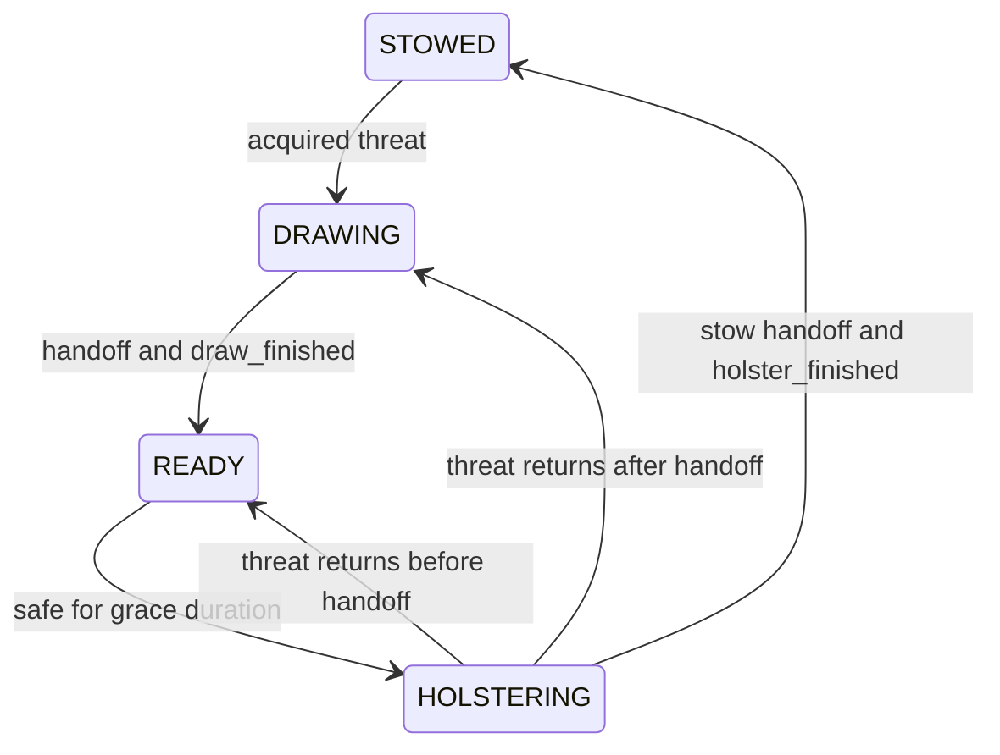

# D0 — stow/draw behavior foundation

`scripts/weapon_behavior.gd` adds a weapon state machine independent of the
existing Idle/Walk/Run compositor. The main CuboidPlayer has a WeaponBehavior
child; legacy actors without that node retain their previous firing behavior.

## Awareness and conditions

The existing AutoPistol target query and combat `living_zombies` registry are
reused. Its traversal now computes both the nearest attack target and nearest
retention-range threat. Results are shared by behavior, movement and firing
within a physics tick/player position/range/registry size. Movement during the
tick can require a refreshed firing query, as before; there is no separate
scene-tree awareness scan. Invalid/dead targets are excluded.

| Weapon | Draw/acquisition radius | Retention/safe radius |
|---|---:|---:|
| Pistol | 8 m | 9.6 m |
| M4A1 | 10 m | 12 m |
| Shotgun | 6 m | 7.2 m |

These follow existing profile target ranges and attack-range upgrades, multiplied
by configurable `retain_range_multiplier` (default 1.20). A stowed weapon does
not draw for an enemy only in the outer band. Once drawn, that band keeps the
weapon ready and resets the grace timer. Only sustained absence beyond the safe
radius starts holstering. `holster_grace_seconds` defaults to 1.5 s.

Drawing finishes even if the threat disappears, then allows a full ready grace
period. Returning threats during grace reset its timer. Holster interruption
before attachment handoff cancels into READY; after handoff it requests DRAWING.

## Categories and attachments

`weapon_fire_profiles.gd` is the single source for category mapping:
Pistol -> PISTOL; M4A1/Shotgun -> LONG_GUN. No filename inference is used.

Existing `WeaponAttachment` under Skeleton3D remains attached to WeaponSocket.
Two BoneAttachment3D children are created under the same Skeleton3D:

| Socket | Existing animated bone | Temporary local position |
|---|---|---|
| BackWeaponSocket | Chest | (0, 0.10, -0.30) m |
| HipWeaponSocket_R | Hips | (-0.40, 0.18, -0.02) m |

Socket local rotation is identity. The stowed weapon preview has zero local
position, X rotation -90 degrees, Z rotation -18 degrees for long guns / 0 for
Pistol, and its existing uniform scale. Reviewed poses place long guns vertically
behind the back and Pistol outside the right leg. These are temporary placements;
no strap or physical holster is added. Sampled views have no severe distracting
clipping. Placement is not polished final animation.

The SAME existing visual instance is reparented between sockets. No weapon,
gameplay logic or skeleton is duplicated. Original hand transforms are captured
once and restored exactly. Inactive weapons return to the original hand parent
and are hidden. Existing muzzle Node3D references remain valid after reparenting.

## Event interface and placeholders

WeaponBehavior centralizes these events:

- `weapon_attach_to_hand(request_id = -1)`
- `weapon_attach_to_back(request_id = -1)`
- `weapon_attach_to_hip(request_id = -1)`
- `draw_finished(request_id = -1)`
- `holster_finished(request_id = -1)`

Signals: `transition_requested(kind, request_id, weapon)`,
`state_changed(previous, current)` and `attachment_changed(socket_name)`.
Bind the emitted request ID to future clip callbacks so stale events from
interrupted/replaced clips cannot affect the new weapon. Completion events
require the proper attachment first. Category-incompatible stow calls are ignored.
Tokenless calls exist for explicit synchronous/manual preview operations.

| Category | Placeholder draw | Placeholder holster |
|---|---:|---:|
| LONG_GUN | 0.55 s | 0.70 s |
| PISTOL | 0.35 s | 0.45 s |

All timings are exposed on WeaponBehavior. `placeholder_transitions = true`
uses one documented configurable midpoint event (fraction 0.5). Attachment
switches discretely there while existing upper-body poses blend over 0.13 s.
There is no authored reaching motion yet: this is visibly a placeholder,
not a claim of final smooth Draw/Holster quality or a procedural imitation.

Set `placeholder_transitions = false` for authored-event mode. Timers no longer
handoff or complete transitions; the animation integration must call the event
API explicitly. Verified tests confirm it waits for those events.

## Runtime preservation and interruptions

READY uses unchanged LongGunHold_V2 for long guns and unchanged WeaponHold for
Pistol. STOWED fades out carry/aim and restores original Idle/Run arm motion,
while the weapon remains visible at the stow socket. Run time is never reset,
movement is never stopped for a transition, and no lower-body tracks are added.
The existing Run scale 1.60, speeds 6.25/4.25 m/s, blend, camera and collision
are unchanged. Hold resources, imported character GLB and both Blender files
retain their hashes. No Blender, rig or animation-data edits occurred.

Weapon switches in READY preserve readiness. During DRAWING they invalidate
old events and restart the new category's placeholder from its correct stow
socket. During HOLSTERING they safely stow the new weapon, hiding/restoring the
old instance. Explicit unequip hides the stowed visual as well as the hand visual.

Death or disabled player physics suspends behavior, invalidates tokens and
settles state to READY or STOWED according to the existing attachment, without
teleporting it. Existing animation freeze and gameplay death remain in control.

Firing adds only a READY/hand-attachment gate. All original projectile, muzzle,
damage, interval, spread, upgrade and <=3 m/s movement checks remain in place.
Moving fire is tested at the original 2.6 m/s combat speed; full 6.25 m/s Run
continues to block firing. Debug HUD shows state, threat, grace, attachment and
PLACEHOLDER; `debug_visible = false` disables the added text.

## Validation, files and next step

112 D0 headless checks pass: all states/categories, hysteresis, grace, both
holster interruptions, enemy lost during Draw, switches in READY/DRAWING/
HOLSTERING, explicit unequip/re-equip, original stowed arm motion, Run lower
poses/continuous clock/direction changes, future-event mode, stale events,
moving fire, death and player disable. A same-tick query test confirms repeated
awareness/target reads share the registry query. Clock error is below 1e-14 s.
Rendered D0 validation covers the same matrix and captures stowed/ready views.
Historical regression baselines disable D0 explicitly: 93 C2 hold checks,
36 authored locomotion checks and 798 movement/weapon checks pass.

Normal-access rendered tests have no engine errors/warnings. Some sandboxed
headless runs report user-log/cache permission messages; normal cache access
resolves those environmental messages. Mobile-device performance is unmeasured.
Runtime cost is one small state node, scalar timers, cached target references,
two BoneAttachment nodes and reparenting at discrete events. No IK, per-frame
bone solving, raycasts, physical attachments, retargeting or extra skeleton.

Runtime files: `weapon_behavior.gd` (new), `auto_pistol.gd`,
`player_weapon_socket.gd`, `player_animation_v2.gd`, `weapon_fire_profiles.gd`,
`scenes/characters/CuboidPlayer.tscn`.
New tests: `tests/validate_weapon_behavior_d0.gd`,
`tests/review_weapon_behavior_d0.gd`. Historical test/review harnesses explicitly
select baseline mode; validation JSON/logs/screenshots are refreshed evidence.

Next: author dedicated Draw/Holster clips in Blender, retaining locomotion and
upper-body filtering. The clip integration should subscribe to transition
requests, play the relevant upper-body clip, fire attachment markers at the
authored handoff frame, then send completion with the captured request ID.
Disable the placeholder timer driver when that integration is ready. Do not
add final transition trajectories during D0.
